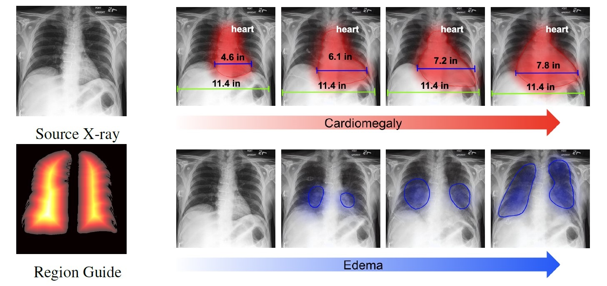

# PIE: Simulating Disease Progression via Progressive Image Editing    

[[Project Homepage](https://www.irohxucao.com/PIE/)]    |    [[Preprint](https://arxiv.org/abs/2309.11745)]     |    [[HuggingFace](https://huggingface.co/papers/2309.11745)]

Official Implementation of "Simulating Disease Progression via Progressive Image Editing".   




Disease progression simulation is a crucial area of research that has significant implications for clinical diagnosis, prognosis, and treatment. One major challenge in this field is the lack of continuous medical imaging monitoring of individual patients over time. To address this issue, we develop a novel framework termed Progressive Image Editing (PIE) that enables controlled manipulation of disease-related image features, facilitating precise and realistic disease progression simulation. Specifically, we leverage recent advancements in text-to-image generative models to simulate disease progression accurately and personalize it for each patient.    

To our best knowledge, PIE is the first of its kind to generate disease progression images meeting real-world standards. It is a promising tool for medical research and clinical practice, potentially allowing healthcare providers to model disease trajectories over time, predict future treatment responses, and improve patient outcomes.     


## Requirements    

Install the newest PyTorch.      

```
conda install pytorch torchvision torchaudio pytorch-cuda=11.8 -c pytorch -c nvidia
```

```
pip install -r requirements.txt
```

## Inference    


### Sampling Script    

Try new pretrained weight from MIMIC-CXR dataset [here](https://huggingface.co/IrohXu/stable-diffusion-mimic-cxr-v0.1)

```
python run_pie.py \
    --pretrained_model_name_or_path="CompVis/stable-diffusion-v1-4" \
    --finetuned_path="path-to-finetune-stable-diffusion-checkpoint" \
    --image_path="./assets/example_inputs/health.jpg" \
    --mask_path="./assets/example_inputs/mask.png" \
    --prompt="clinical-reports-about-any-diseases" \
    --step=10 \
    --strength=0.5 \
    --guidance_scale=27.5 \
    --seed=42 \
    --resolution=512
```

## Reference      

```
@misc{liang2023pie,
      title={PIE: Simulating Disease Progression via Progressive Image Editing}, 
      author={Kaizhao Liang and Xu Cao and Kuei-Da Liao and Tianren Gao and Wenqian Ye and Zhengyu Chen and Jianguo Cao and Tejas Nama and Jimeng Sun},
      year={2023},
      eprint={2309.11745},
      archivePrefix={arXiv},
      primaryClass={eess.IV}
}
```

## Development Timeline

`10/01/2023` Release a new pretrained weight for MIMIC-CXR dataset [here](https://huggingface.co/IrohXu/stable-diffusion-mimic-cxr-v0.1).       
`11/15/2023` Embed PIE with GPT-4V or LLaVA and release checkpoint demo. Update inference pipeline.        
`11/28/2023` Kaizhao Liang and Wenqian Ye will present PIE at [UVa AIML Seminar](https://uvaml.github.io/).        
`2024` Release PIE v2 and new checkpoint.       


